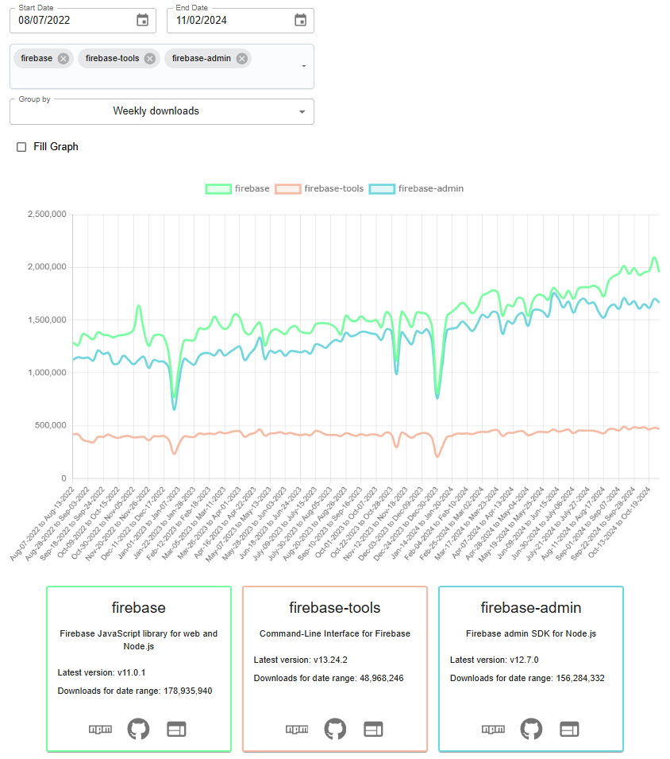

# NPM Downloads

A site to get metrics on the number of downloads for an NPM library. Visit the site at https://npmdownloads.web.app

## Queries

| Name                | Value               | Kind      | Notes                           |
| ------------------- | ------------------- | --------- | ------------------------------- |
| selectedNpmPackages | string              | **Query** | NPM packages to search          |
| startDate           | `yyyy-mm-dd`        | **Query** | Download start date             |
| endDate             | `yyyy-mm-dd`        | **Query** | Download end date               |
| groupDownloadsBy    | `weekly` or `daily` | **Query** | How to group the downloads      |
| isGraphFillChecked  | boolean             | **Query** | Fills the line graph if enabled |

### Query example

https://npmdownloads.web.app/?startDate=2024-06-02&endDate=2024-10-19&groupDownloadsBy=weekly&selectedNpmPackages=firebase,firebase-tools,firebase-functions
